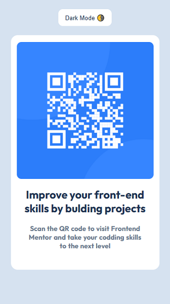
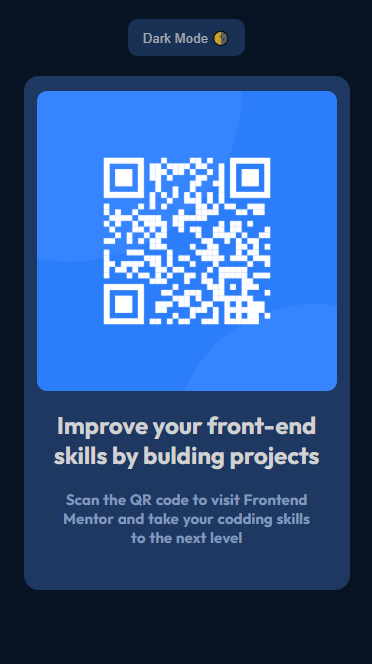

### Frontend Mentor - QR Code Component Solution

This is a solution to the [QR code component challenge on Frontend Mentor](https://www.frontendmentor.io/challenges/qr-code-component-iux_sIO_H).

### The designs were created to the following widths:

- Mobile: 375px
- Desktop: 1440px

### Screenshots




### Built with

- HTML5 semantic markup
- CSS custom properties
- Flexbox
- Responsive design
- **Light/Dark theme toggle (using CSS variables and JavaScript)**

### Theme Toggle Feature 🌗

A **light/dark theme toggle** has been implemented to enhance the user experience.  
The feature uses **CSS custom properties** (variables) combined with a small **JavaScript** snippet to dynamically switch between color palettes.

#### How it works:

- The default theme is set via the `<html data-theme="light">` attribute.
- CSS variables are defined in the `:root` selector for the light theme.
- An additional `[data-theme="dark"]` selector overrides these variables with darker shades.
- A button triggers a JavaScript function that toggles the `data-theme` attribute between `"light"` and `"dark"`.

#### Example Code:

```js
const html = document.documentElement;

function toggleTheme() {
  if (html.getAttribute("data-theme") === "dark") {
    html.setAttribute("data-theme", "light");
  } else {
    html.setAttribute("data-theme", "dark");
  }
}

document.getElementById("themeToggle").addEventListener("click", toggleTheme);
```
